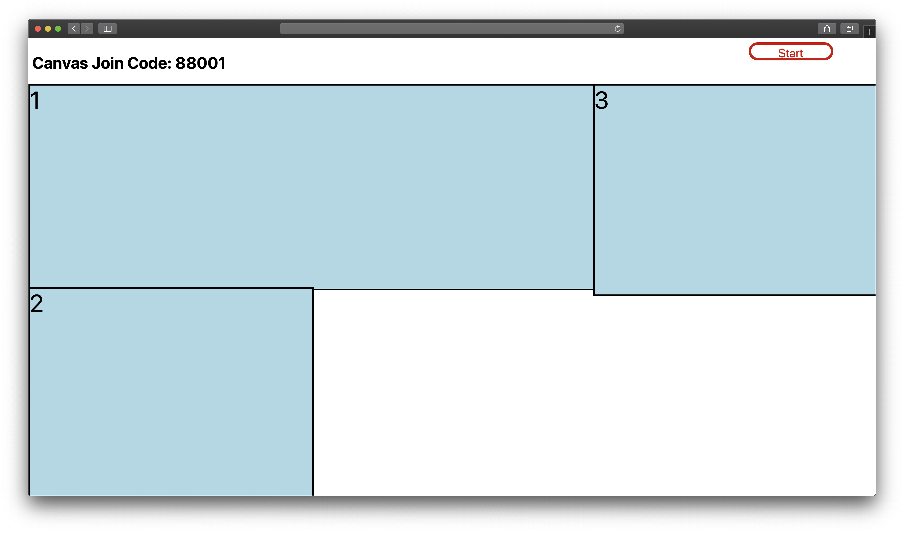
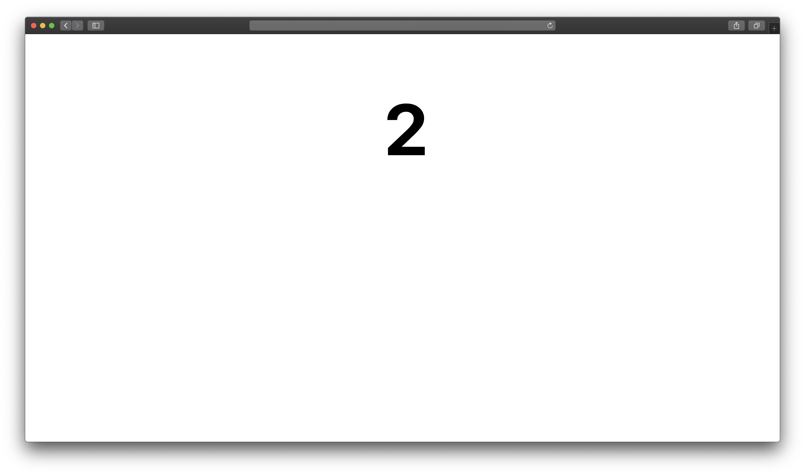
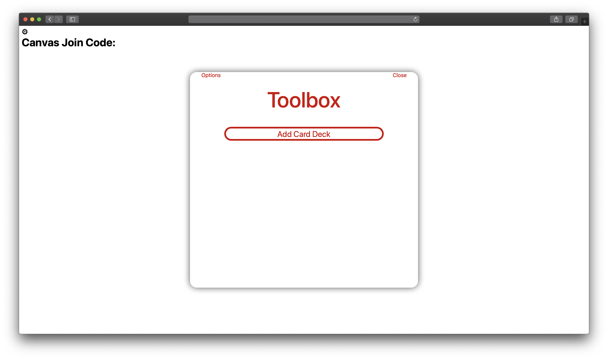
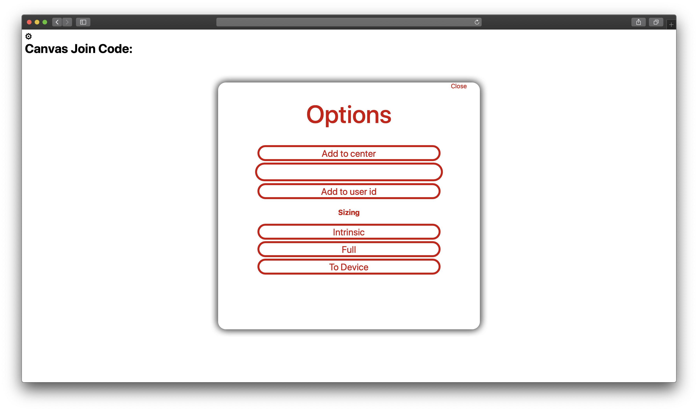

# Pad

Combines multiple devices into one continuous canvas.  
Currently a work in progress.  
  
Screenshots and a live web link will be added soon.

## How does it work?
- Users navigate to a static webpage (index.html)
- A user can either join an existing pad or create a new one.
- New clients, moving objects, or other messages are sent via WebSockets.
    - A browser sends a WebSocket frame to a Python WebSocket server.
    - The server sends the WebSocket frame to all the other users in the pad.
    - See the `send_to_canvas` method in responder.py and `ServerconnService` in main.js.

## Screenshots
### Landing

### Device Layout

### Device Identification (just a number lol)

### Toolbox (more later)

### Options

## Credits
- Johan Hanssen Seferidis under the MIT License
    - websocket_server.py
